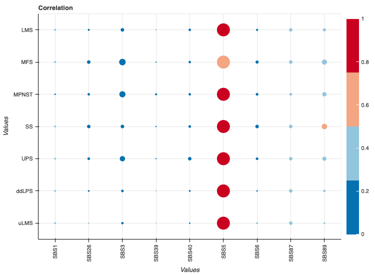

<style>
body {
text-align: justify}
</style>

# Signatures TCGA-SARC
Signatures were computed using the R package Mutational Patterns (@mutationalpatterns).

I got the MAF files from TCGA and splited the maf by sample name,
Every maf I converted to vcf in python.

```{r pressure, echo=FALSE, out.width = '100%'}

```

---
nocite: '@*'
---
